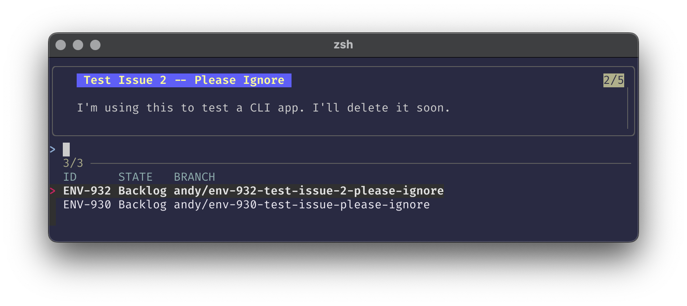

# git-linear

Work with your Linear tickets from the command line.

# Usage

```
git-linear branch
```

This command will open an interactive UI (using [fzf](https://github.com/junegunn/fzf)) where you can
select from the Linear tickets assigned to you.



```
git-linear open
```

Opens your browser and navigates to the Linear ticket page for the current
branch's issue.

# Installation

You will first need to ensure you have [fzf](https://github.com/junegunn/fzf)
installed.

Additionally, you need to generate a Linear API token and save it in the
`~/.linear_token` file. You can create new tokens from your user settings
page.

With Go:
```
go install github.com/andyscott/git-linear/cmd/git-linear@latest
```

With Nix:
_details coming soon..._